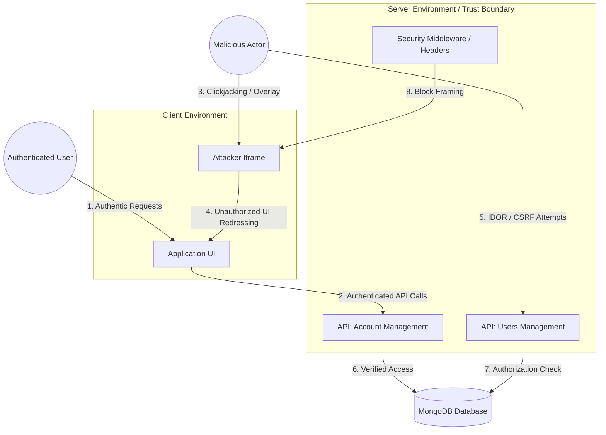
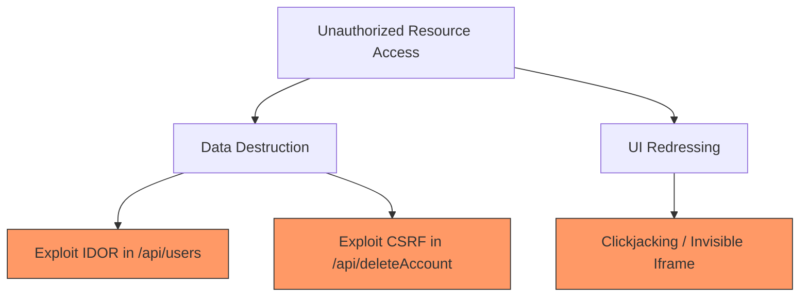

# Threat Model & Risk Assessment

**Project:** SecureApp-Sprint-VulnSight  
**Document version:** 1.2 (Post-Mitigation)  
**Security Framework:** STRIDE / CVSS v3.1

---

## 1. Data Flow Diagram (DFD)

The following diagram illustrates the data flows and trust boundaries within the application, highlighting potential attack vectors addressed during this security sprint.

---

## 2. STRIDE Threat Analysis

| Threat Category | Applied Threat Description | Vulnerable Endpoint | Mitigation Strategy (Applied) |
| :--- | :--- | :--- | :--- |
| **S**poofing | Attacker triggers actions on behalf of a victim via CSRF. | `/api/deleteAccount` | Anti-CSRF Headers & SameSite Cookies |
| **T**ampering | Unauthorized modification of user data via IDOR. | `/api/users (DELETE)` | Object-level Authorization (RBAC) |
| **R**epudiation | Actions performed without audit trail. | `/api/deleteAccount` | Enhanced Server-side Logging |
| **I**nformation Disclosure | Accessing user PII without permission. | `/api/account (GET)` | Strict Session & Ownership Validation |
| **D**enial of Service | Mass account deletion via automated IDOR script. | `/api/users (DELETE)` | Authorization Checks + Rate Limiting |
| **E**levation of Privilege | Standard user deleting other users. | `/api/users (DELETE)` | Role-Based Access Control (Admin only) |

---

## 3. Risk Assessment (CVSS v3.1)

| Vulnerability | Attack Vector | CVSS Base Score | Severity | Mitigation Status |
| :--- | :--- | :--- | :--- | :--- |
| **IDOR** | Network | **8.1** | **High** | **REMEDIATED**: Added ownership verification. |
| **CSRF** | Network | **6.5** | **Medium** | **REMEDIATED**: Implemented cookie safety. |
| **Clickjacking** | Network | **4.3** | **Medium** | **REMEDIATED**: Global `X-Frame-Options` header. |

---

## 4. Attack Tree (Unauthorized Resource Access)

---

## 5. Security Posture Summary
The initial threat model identified **IDOR** as a critical risk. Following the security sprint, all identified high and medium severity risks have been mitigated by transitioning from implicit trust to explicit authorization and implementing robust defense-in-depth headers.
